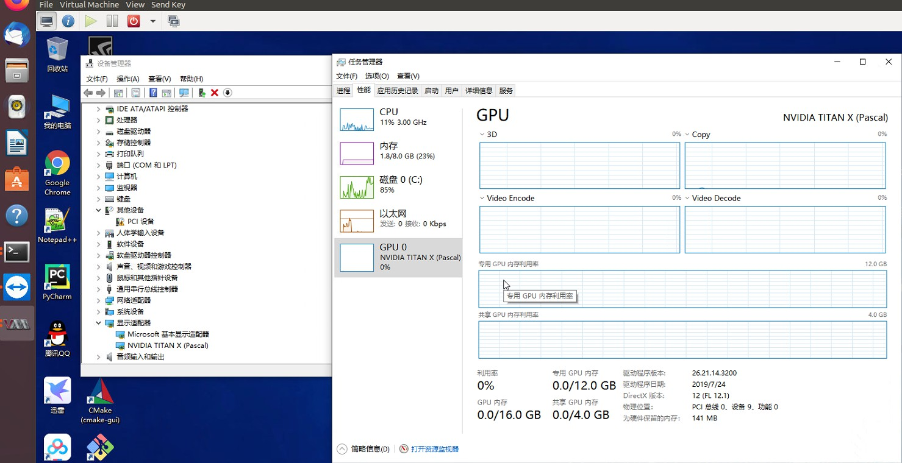

# kvm-GPU-passthrough
kvm GPU passthrough, kvm GPU透传, kvm GPU直通

## 背景介绍
对于GTX系列的显卡，如果主机为linux系统，想将显卡给虚拟机（windows或者linux）使用，则需要用到GPU透传（GPU passthrough）技术。首先在透传前先检查主机硬件是否满足条件：
- （可选）使用命令检查主板是否支持IOMMU，若支持IOMMU，执行以下命令控制台会有输出（非空）。
dmesg | grep -i 'Directed I/O'

- （必选）使用命令检查主机是否通过UEFI方式启动，若是以此种方式启动，执行以下命令会有输出（非空）。
dmesg | grep -i efi

注：（可选）表明不一定要满足此条件，（必选）表明一定要满足该条件。

## kvm GPU透传、 kvm GPU直通
kvm 透传、直通步骤
1. kvm GPU透传步骤一：主机显卡配置
2. kvm GPU透传步骤二：安装和配置虚拟机
3. kvm GPU透传步骤三：驱动配置

## kvm GPU透传、 kvm GPU直通透传截图

## 详细步骤与操作流程
目前kvm GPU透传配置的中文资料很少，其中坑也很多，我费了不少时间摸索，最终nvidia显卡透传成功。码字不易，请多多支持，谢谢❥(^_-)。

详细步骤与操作流程：https://mianbaoduo.com/o/bread/ZJiTk5g=

